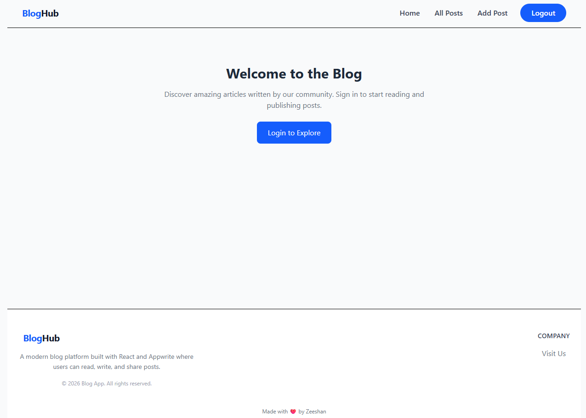

# React Blog App

A modern full-stack blog platform built with **React, Redux Toolkit, Appwrite, and Tailwind CSS**.
Users can sign up, log in, create posts, upload images, edit or delete posts, and view blog content in a clean responsive interface.

---

## 🚀 Live Demo

https://bloghubz.vercel.app

---

## ✨ Features

* 🔐 **Authentication**

  * User signup and login
  * Session management

* 📝 **Post Management**

  * Create posts
  * Edit posts
  * Delete posts
  * Rich text editor

* 🖼 **Image Upload**

  * Upload featured images
  * Image storage using Appwrite

* 📚 **Post Listing**

  * Home page displaying posts
  * Dedicated "All Posts" page

* ⚡ **Modern UI**

  * Responsive layout
  * Skeleton loading
  * Clean navigation
  * Rich text editing with TinyMCE

* 🔒 **Protected Routes**

  * Only logged-in users can create or edit posts

---

## 🛠 Tech Stack

### Frontend

* React
* React Router
* Redux Toolkit
* React Hook Form
* Tailwind CSS
* TinyMCE Rich Text Editor

### Backend

* Appwrite (Authentication, Database, Storage)

### Deployment

* Vercel

---

## 📂 Project Structure

```
src
 ├── appwrite
 │   ├── auth.js
 │   └── config.js
 │
 ├── components
 │   ├── Button.jsx
 │   ├── Container.jsx
 │   ├── Header.jsx
 │   ├── Footer.jsx
 │   ├── PostCard.jsx
 │   ├── PostForm.jsx
 │   └── RTE.jsx
 │
 ├── pages
 │   ├── Home.jsx
 │   ├── Login.jsx
 │   ├── Signup.jsx
 │   ├── AddPost.jsx
 │   ├── EditPost.jsx
 │   ├── AllPosts.jsx
 │   └── Post.jsx
 │
 ├── store
 │   └── authSlice.js
 │
 ├── App.jsx
 └── main.jsx
```

---

## ⚙️ Environment Variables

Create a `.env` file in the project root:

```
VITE_APPWRITE_URL=
VITE_APPWRITE_PROJECT_ID=
VITE_APPWRITE_DATABASE_ID=
VITE_APPWRITE_COLLECTION_ID=
VITE_APPWRITE_BUCKET_ID=
```

These values can be obtained from your **Appwrite Console**.

---

## 📦 Installation

Clone the repository:

```
git clone https://github.com/yourusername/react-blog-app.git
```

Move into the project directory:

```
cd Blog-App
```

Install dependencies:

```
npm install
```

Run the development server:

```
npm run dev
```

---

## 🌐 Deployment

This project is deployed using **Vercel**.

Steps:

1. Push the project to GitHub
2. Import the repository in Vercel
3. Add the environment variables
4. Deploy

---

## 📸 Screenshots



---

## 📌 Future Improvements

* Search functionality
* Post categories
* Comment system
* User profiles
* Dark mode
* Pagination

---

## 👨‍💻 Author

Zeeshan, 
B.Tech CSE Student

---

## 📜 License

This project is open source and available under the MIT License.
